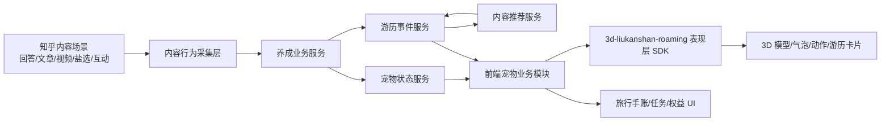
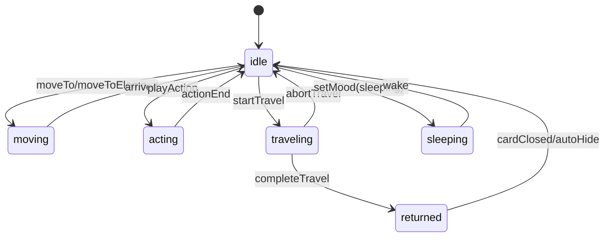
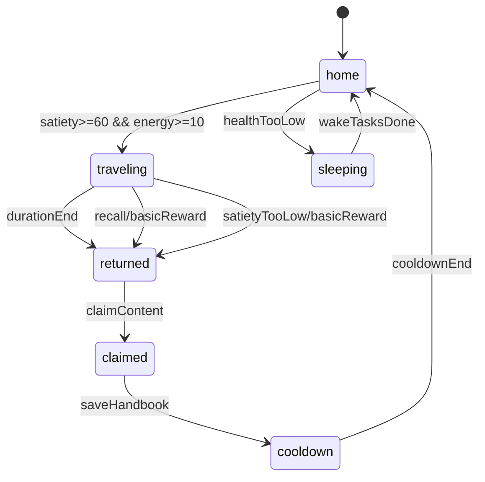

# 知乎刘看山虚拟宠物开发方案

版本：V1.2 技术方案草案  
输入资料：
- `3d-liukanshan-roaming/SKILL.md`
- `3d-liukanshan-roaming/roaming-character.js`
- `3d-liukanshan-roaming/优化内容.txt`
- `知乎刘看山虚拟宠物产品方案——内容消费驱动型养成互动（V1.2 游历事件完整版）.docx`

## 1. 方案结论

当前 `3d-liukanshan-roaming` 已具备“3D 刘看山轻量悬浮展示 + 气泡文案 + 程序化移动”的基础能力，适合作为虚拟宠物产品的前端表现层 SDK。产品文档要求的是完整的“内容消费驱动养成 + 游历推荐闭环”，因此研发上应拆为两层：

1. 表现层 SDK：继续由 `3d-liukanshan-roaming` 承担，只处理模型渲染、动作、气泡、游历进度、归来卡片入口等用户可见反馈。
2. 业务层系统：由产品业务模块承担内容行为采集、养成数值计算、游历调度、内容推荐、风控防刷、数据持久化和权益发放。

核心原则是：roaming skill 不内置知乎业务规则、不存用户数据、不请求后端，只暴露标准 API；业务侧把状态和事件传给它，它负责把“看山活起来”。

## 2. V1 目标范围

V1 建议优先交付完整闭环，而不是一次性做满全部权益系统。

### 2.1 必做能力

- 领养与悬浮展示：用户首次进入可领养刘看山，之后在首页、内容详情页、个人主页以悬浮形态展示。
- 内容喂养：接收回答、文章、视频、盐选试读、点赞、收藏、评论、分享等内容行为，转化为口粮、成长值、心情值、游历精力。
- 宠物状态：维护饱食度、心情值、健康值、成长等级、游历精力、游历状态、冷却状态。
- 基础互动：点击摸头、对话、拖动或程序移动、状态气泡反馈。
- 游历事件：支持“北极远行”和“山海漫游”两类 V1 主题，完成出发、游历中、归来、内容领取、冷却。
- 旅行手账：保存每次游历主题、轨迹文案、带回内容、看山留言。
- 性能降级：支持关闭动画、极简模式、低端设备自动降级。

### 2.2 V1 暂缓能力

- 城市漫步、知识渔场可作为 V1.5/V2。
- 社交串门、排行榜、内容互助建议进入 V2。
- 权益兑换、创作者流量扶持、全量成就体系建议进入 V2/V3。
- 复杂模型换装、骨骼动画大规模扩展可在核心闭环验证后推进。

## 3. 总体架构



### 3.1 前端分层

- `PetAppShell`：挂载入口，负责领养态、页面生命周期、多端容器适配。
- `PetStateStore`：保存当前用户宠物状态，订阅后端状态同步。
- `ContentEventAdapter`：从知乎内容页、视频页、盐选页接收行为事件。
- `RewardEngineClient`：向后端提交有效内容行为，拉取奖励结果。
- `TravelController`：控制游历出发、召回、轮询/订阅进度、归来领取。
- `HandbookPanel`：旅行手账列表、详情、内容跳转。
- `RoamingAdapter`：封装 `3d-liukanshan-roaming`，把业务状态翻译为表现层 API 调用。

### 3.2 后端分层

- 内容行为服务：接收阅读进度、停留时长、互动、付费、完播等事件，做有效性判断。
- 养成服务：计算口粮、成长值、心情值、健康值、等级、游历精力。
- 游历服务：管理游历状态机、冷却、时长、提前召回、结果生成。
- 推荐服务适配器：按游历主题和用户标签拉取优质内容。
- 风控服务：防刷、异常行为识别、单篇内容奖励去重、频控。
- 手账服务：保存游历历史、带回内容、领取状态、分享状态。

## 4. `3d-liukanshan-roaming` 改造方案

### 4.1 保留现有能力

现有 API 可继续兼容：

- `initRoamingCharacter(options)`
- `setMessage(text, options?)`
- `moveTo(x, y, options?)`
- `moveToElement(element, options?)`
- `getPosition()`
- `isMovingStatus()`

这些能力可直接支撑页面引导、内容卡片指向、普通互动反馈。

### 4.2 新增表现层 API

建议在不破坏现有 API 的前提下新增以下方法：

```ts
type TravelTheme = "arctic" | "mountain" | "city" | "fishery";
type PetMood = "normal" | "happy" | "tired" | "sleeping";
type PetAction = "wave" | "pat" | "jump" | "walk" | "read" | "fish" | "return";

interface TravelStartOptions {
  theme: TravelTheme;
  durationMs: number;
  message?: string;
  onAbort?: () => void;
  onComplete?: () => void;
}

interface TravelReturnOptions {
  theme: TravelTheme;
  title: string;
  summary: string;
  contentId: string;
  message?: string;
  onOpenContent?: (contentId: string) => void;
}
```

- `startTravel(options)`：隐藏或弱化模型，显示游历中气泡/进度，进入外出状态。
- `completeTravel(options)`：模型从屏幕边缘归来，播放归来动作，展示轻量游历卡片入口。
- `abortTravel(reason?)`：中断游历，恢复留守状态，显示召回/失败原因。
- `setMood(mood, options?)`：切换正常、开心、疲倦、休眠等表现。
- `playAction(action, options?)`：播放单次动作，结束后恢复待机。
- `showRecommendationCard(payload)`：展示带回内容气泡卡片，点击由业务回调处理。
- `setDisplayMode("normal" | "mini" | "hidden" | "simple")`：支持最小化、隐藏、极简模式。
- `destroy()`：解绑监听和 Three.js 资源，避免 SPA 页面泄漏。

### 4.3 内部状态机



优先级建议：`sleeping > traveling > action > moving > idle`。高优先级指令可中断低优先级表现，避免动画和状态冲突。

### 4.4 CSS/DOM 扩展

保留当前结构：

```html
<div class="roaming-character" id="roamingCharacter">
  <div class="speech-bubble" id="speechBubble"></div>
  <canvas class="character-canvas" id="characterCanvas"></canvas>
  <div class="character-shadow" id="characterShadow"></div>
</div>
```

新增可选节点由 SDK 自动创建：

- `.travel-progress`：游历倒计时/进度条。
- `.pet-reward-popover`：口粮、成长值、心情值浮层。
- `.travel-return-card`：游历归来卡片入口。
- `.pet-minimized-button`：最小化入口。

业务侧不应直接操作这些 DOM，应通过 API 调用。

## 5. 业务状态与数值模型

### 5.1 宠物主状态

```ts
interface PetProfile {
  userId: string;
  adopted: boolean;
  stage: "cub" | "growing" | "adult" | "advanced";
  level: number;
  exp: number;
  satiety: number;
  mood: number;
  health: number;
  travelEnergy: number;
  travelStatus: "home" | "traveling" | "returned" | "cooldown" | "sleeping";
  cooldownUntil?: string;
  currentTravelId?: string;
  updatedAt: string;
}
```

### 5.2 内容行为事件

```ts
interface ContentConsumptionEvent {
  eventId: string;
  userId: string;
  contentId: string;
  contentType: "answer" | "article" | "column" | "video" | "live" | "yanxuan";
  action: "read" | "watch" | "like" | "collect" | "comment" | "share" | "pay";
  completionRatio?: number;
  durationSec: number;
  tags: string[];
  occurredAt: string;
}
```

### 5.3 奖励计算基线

| 行为 | 判定条件 | 奖励 |
| --- | --- | --- |
| 普通回答/文章 | 完读 >= 70%，停留 >= 30 秒 | 基础口粮 x1，成长值 +5，游历精力 +1 |
| 视频 | 完播或观看 >= 60% | 基础口粮 x1，成长值 +8，游历精力 +1 |
| 盐选试读 | 试读 >= 60 秒 | 优质口粮 x1，成长值 +10，游历精力 +2 |
| 盐选付费/完整阅读 | 支付成功或完整阅读 | 珍稀口粮 x2，成长值 +20，游历精力 +5 |
| 点赞/收藏/评论/分享 | 有效互动 | 心情值 +10，随机道具，游历精力 +1 |
| 每日签到 + 浏览 3 条 | 当日首次达成 | 每日礼包，游历精力 +3 |
| 垂类任务 | 任务达成 | 双倍口粮，成长值翻倍，游历精力 +5 |

### 5.4 衰减与休眠

- 饱食度按时间自然衰减，建议服务端按 `lastUpdatedAt` 懒计算，避免定时写库。
- 健康值由连续有效内容消费维持，长期低饱食或低活跃进入休眠。
- 休眠后禁止游历和普通互动，仅允许唤醒任务。
- 唤醒条件：完成 3 条优质内容消费，恢复基础健康和饱食。

## 6. 游历事件设计

### 6.1 游历状态机



### 6.2 游历主题匹配

| 主题 | V1 优先级 | 触发偏好 | 带回内容 | 表现层动作 |
| --- | --- | --- | --- | --- |
| 北极远行 | V1 | 科普、科技、理科、专业类 | 冷门科普、硬核干货、学术优质文章 | 雪地行走、探索、归来 |
| 山海漫游 | V1 | 生活、旅行、文化、美食 | 旅行攻略、地域文化、历史人文、美食探店 | 登山、漫步、打卡 |
| 城市漫步 | V2 | 职场、情感、社科、成长 | 职场经验、成长故事、人文社科 | 城市漫步、读书 |
| 知识渔场 | V2 | 心情 >= 80，成年期，双倍精力 | 高赞回答、盐选精选、深度长文 | 钓鱼、等待、收竿 |

### 6.3 分发规则

- 70% 用户偏好内容：依据近期浏览、互动、搜索标签。
- 20% 垂类优质小众内容：用于拓展兴趣边界。
- 10% 盐选优质内容：用于商业转化，但必须控制频率和标识清晰。
- 质量过滤：原创、无违规、高完读率、低投诉、近期仍有效。
- 等级加成：等级越高，内容深度、稀缺性、数量越高；成年期可一次带回 2-3 篇。

### 6.4 游历时长与消耗

| 阶段 | 基础时长 | 内容数量 | 备注 |
| --- | --- | --- | --- |
| 幼崽期 | 30 分钟 | 1 篇 | V1 默认 |
| 成长期 | 20 分钟 | 1 篇 | 可解锁第二主题 |
| 成年期 | 10 分钟 | 2-3 篇 | V2 扩展 |
| 进阶形态 | 可配置 | 2-3 篇 + 稀有掉落 | V3 扩展 |

V1 可在 Demo/灰度环境把时长压缩为 30-120 秒，生产按产品配置下发。

## 7. 接口草案

### 7.1 宠物状态

```http
GET /api/pet/profile
POST /api/pet/adopt
POST /api/pet/interact
GET /api/pet/tasks/daily
```

`GET /api/pet/profile` 返回：

```json
{
  "adopted": true,
  "stage": "cub",
  "level": 3,
  "satiety": 76,
  "mood": 82,
  "health": 91,
  "travelEnergy": 14,
  "travelStatus": "home",
  "cooldownUntil": null
}
```

### 7.2 内容行为与奖励

```http
POST /api/pet/content-events
```

请求体：

```json
{
  "contentId": "answer_123",
  "contentType": "answer",
  "action": "read",
  "completionRatio": 0.82,
  "durationSec": 46,
  "tags": ["科技", "科普"]
}
```

返回：

```json
{
  "valid": true,
  "reward": {
    "food": 1,
    "exp": 5,
    "mood": 0,
    "travelEnergy": 1
  },
  "profile": {}
}
```

### 7.3 游历

```http
POST /api/pet/travels/start
POST /api/pet/travels/{travelId}/recall
GET /api/pet/travels/{travelId}
POST /api/pet/travels/{travelId}/claim
GET /api/pet/handbooks
```

`POST /api/pet/travels/start` 返回：

```json
{
  "travelId": "travel_001",
  "theme": "arctic",
  "durationSec": 1800,
  "startedAt": "2026-05-08T10:00:00+08:00",
  "expectedReturnAt": "2026-05-08T10:30:00+08:00",
  "message": "看山踏上北极探险之路，去寻找冷门硬核干货，耐心等它回家"
}
```

`GET /api/pet/travels/{travelId}` 在归来时返回：

```json
{
  "travelId": "travel_001",
  "status": "returned",
  "theme": "arctic",
  "message": "冰川里挖到一篇硬核科普，小众又干货，主人一定会喜欢",
  "contents": [
    {
      "contentId": "article_456",
      "title": "一篇硬核科普文章",
      "summary": "适合你近期科技兴趣的深度内容",
      "url": "https://www.zhihu.com/..."
    }
  ]
}
```

## 8. 前端核心流程

### 8.1 内容喂养流程

1. 内容页上报阅读/观看进度。
2. `ContentEventAdapter` 达到阈值后提交后端。
3. 后端返回奖励和新宠物状态。
4. `PetStateStore` 更新。
5. `RoamingAdapter` 调用：
   - `playAction("read" | "jump")`
   - `setMessage("吃到一口好内容，精力 +1")`
   - `setMood("happy")`

### 8.2 主动出门游历流程

1. 用户点击“出门游历”。
2. 前端检查本地状态是否满足饱食度和精力门槛，不满足则展示原因。
3. 调用 `/api/pet/travels/start`。
4. 调用 `roaming.startTravel({ theme, durationMs, message })`。
5. 页面显示游历进度，可最小化。
6. 到点轮询或长连接收到归来状态。
7. 调用 `roaming.completeTravel(result)`。
8. 用户点击归来卡片领取内容。
9. 调用 `/api/pet/travels/{id}/claim`，保存手账并进入冷却。

### 8.3 休眠唤醒流程

1. 服务端判定健康值过低，返回 `travelStatus = sleeping`。
2. 前端调用 `setMood("sleeping")`，禁用游历按钮。
3. UI 展示“完成 3 条优质内容唤醒”。
4. 每完成一条有效内容，更新唤醒进度。
5. 达成后调用唤醒接口，SDK 恢复 `setMood("normal")`。

## 9. 数据存储建议

### 9.1 表结构

- `pet_profile`：用户宠物主档案。
- `pet_resource_log`：口粮、成长值、心情、精力变动流水。
- `pet_content_event`：内容行为事件与有效性判断结果。
- `pet_travel`：游历实例、主题、开始/结束/状态/冷却。
- `pet_travel_content`：游历带回内容。
- `pet_handbook`：旅行手账。
- `pet_daily_task`：每日任务进度。
- `pet_item_inventory`：道具和权益库存，V2 可启用。

### 9.2 一致性

- 奖励发放、宠物状态更新、流水写入必须在同一事务内完成。
- 内容事件用 `userId + contentId + action + rewardType` 做幂等键。
- 游历开始需原子扣减游历精力并锁定状态，避免重复出发。
- 内容领取需幂等，重复点击只返回已领取结果。

## 10. 风控与防刷

- 单篇内容仅首次有效阅读发放核心奖励。
- 普通图文需完读 >= 70% 且停留 >= 30 秒。
- 视频需完播或观看 >= 60%，同时校验播放心跳。
- 阅读进度上报需服务端校验时间跨度，拒绝瞬时跳进度。
- 高频点赞/收藏/分享需限流，异常互动只计展示不发奖励。
- 同一设备、多账号、同 IP 异常行为进入风控降权。
- 盐选付费奖励以支付/权益系统结果为准，前端事件不可直接发放。

## 11. 性能与兼容

- GLB 模型继续轻量化，目标首包模型小于 2 MB，后续装扮按需加载。
- Three.js 渲染循环在隐藏、最小化、页面后台时降帧或暂停。
- `renderer.setPixelRatio(Math.min(devicePixelRatio, 2))` 保留，低端机可降为 1。
- 支持 `prefers-reduced-motion`，系统减少动态效果时自动使用极简模式。
- 业务页面滚动、点击优先级高于宠物，悬浮层避免遮挡主内容。
- SPA 切页必须调用 `destroy()` 或复用单例，防止事件监听和 WebGL 上下文泄漏。
- App 内嵌 H5 需要统一 z-index、沉浸式安全区、横竖屏适配。

## 12. 开发拆解

### Sprint 0：资产与基线整理

- 确认最终刘看山 GLB 文件、大小、骨骼/动画命名。
- 统一 `liukanshan.glb` 与 `低面数.glb` 命名和引用路径。
- 为 `3d-liukanshan-roaming` 增加本地 demo 页和基础视觉验收用例。
- 输出动作清单：待机、走路、开心、疲倦、休眠、出发、归来。

### Sprint 1：表现层 SDK 扩展

- 新增内部状态机和指令优先级。
- 实现 `startTravel`、`completeTravel`、`abortTravel`。
- 实现 `setMood`、`playAction`、`showRecommendationCard`、`setDisplayMode`、`destroy`。
- 增加游历进度、奖励浮层、归来卡片样式。
- 保证现有 `setMessage`、`moveTo`、`moveToElement` 全兼容。

### Sprint 2：前端业务壳

- 实现领养入口、宠物状态面板、每日任务面板。
- 实现 `PetStateStore` 与后端状态同步。
- 实现 `ContentEventAdapter`，在内容详情页模拟/接入阅读进度。
- 将奖励结果映射为 SDK 气泡和动作。

### Sprint 3：后端养成与内容事件

- 建表并实现宠物档案、资源流水、内容事件幂等。
- 实现奖励计算规则和基础防刷阈值。
- 实现饱食度、健康值、冷却等懒计算逻辑。
- 提供 `GET /api/pet/profile`、`POST /api/pet/adopt`、`POST /api/pet/content-events`。

### Sprint 4：游历闭环

- 实现游历开始、召回、状态查询、领取接口。
- 接入推荐服务或 mock 推荐池，完成北极远行、山海漫游。
- 实现旅行手账保存和列表。
- 前端完成出发、游历中、归来、领取、冷却完整体验。

### Sprint 5：灰度与优化

- 增加埋点：展示、点击、领养、奖励、游历开始、归来、内容领取、关闭动画。
- 增加 A/B：宠物入口样式、奖励强度、游历时长、推荐卡片文案。
- 增加性能监控：FPS、WebGL 初始化失败、模型加载耗时、JS 错误。
- 按用户留存、内容消费时长、完读率、游历领取率评估是否扩展 V2。

## 13. 验收标准

### 13.1 表现层

- 页面可正常加载 3D 刘看山，GLB 加载失败时有占位模型。
- `setMessage`、`moveTo`、`moveToElement` 兼容旧示例。
- 游历状态下模型和气泡表现正确，完成后可归来并展示卡片。
- 休眠、开心、疲倦等状态可被业务侧切换。
- 最小化、隐藏、极简模式可用。
- SPA 页面销毁后无重复监听、无持续渲染泄漏。

### 13.2 业务闭环

- 达成内容消费阈值后只发放一次奖励。
- 奖励能正确更新饱食度、成长值、心情值、游历精力。
- 满足条件可出发游历，不满足时给出明确原因。
- 游历归来内容可领取，领取后写入手账。
- 归来后冷却 10 分钟，冷却期间不可重复游历。
- 饱食度/健康值过低时进入休眠，完成唤醒任务后恢复。

### 13.3 风控与推荐

- 快速刷进度、重复刷新、重复互动不会重复发奖励。
- 推荐内容符合主题、无违规、可跳转。
- 盐选内容占比受控，不影响用户体验。

## 14. 主要风险与应对

| 风险 | 影响 | 应对 |
| --- | --- | --- |
| 3D 性能影响阅读 | 降低内容消费体验 | 极简模式、后台暂停渲染、低端机降级 |
| 宠物遮挡内容 | 影响主流程 | 避让核心 UI、可拖动、可最小化 |
| 内容奖励被刷 | 数据污染、权益损耗 | 幂等、阈值、心跳、异常检测 |
| 推荐内容不准 | 降低游历价值 | 引入反馈、偏好/探索配比、质量过滤 |
| 玩法太重 | 用户倦怠 | V1 控制入口和步骤，优先轻陪伴 |
| 表现层混入业务 | 后续难维护 | SDK 只接受参数和回调，不请求业务接口 |

## 15. 推荐的 V1 交付口径

V1 不追求“完整游戏化系统”，而是先证明一个闭环：

用户读内容，刘看山获得状态提升；状态足够后它出门游历；游历归来带回符合用户兴趣的优质内容；用户阅读后继续喂养刘看山。

在研发实现上，先把这个闭环做稳定、可观测、可灰度，再扩展更多游历主题、社交、权益和装扮。
